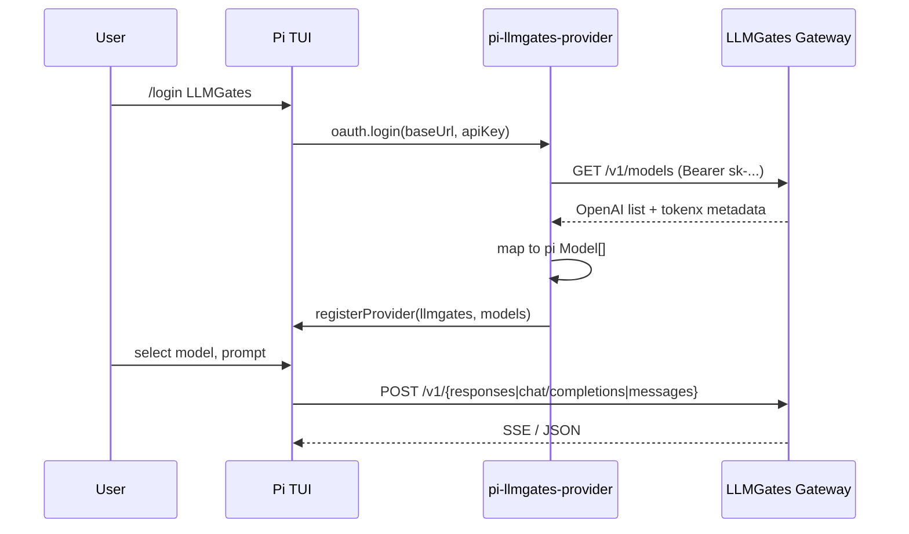

# Pi.dev 插件：LLMGates Provider

- **日期**: 2026-07-22
- **状态**: Phase 1 已落盘（v0.1.0）；Phase 2 待 TokenX [#1080](https://github.com/ax128/TokenX/issues/1080)
- **仓库**: `pi_llmgates`（插件） + `ax128/TokenX`（网关后端）
- **参考**: [@router-for-me/pi-cliproxyapi-provider](https://pi.dev/packages/@router-for-me/pi-cliproxyapi-provider)

## 1. 背景与目标

LLMGates（TokenX 网关）已提供 OpenAI 兼容 API（`https://api.llmgates.com/v1`、`https://apicn.llmgates.com/v1`），用户用 `sk-llmgates-*` API Key 即可调用 chat/responses/messages 等端点。

Pi.dev 是本地/终端 AI coding agent，通过 **provider extension** 注册模型与推理后端。目标：发布 npm pi package，让用户 `pi install npm:@llmgates_api/pi-llmgates-provider` 后，在 pi 里 `/login LLMGates` 配置网关地址 + API Key，自动拉取可用模型并走平台计费路由。

### 成功标准

1. 安装插件后 `/login LLMGates` 可完成 baseUrl + apiKey 配置，并以 `GET /v1/models` 校验凭证（HTTP 200 = 成功）。
2. 模型列表与 Key 的 `allowed_models` 一致（网关已有行为）。
3. 按模型 `web_chat_endpoint` 自动选择 pi 推理 API（responses / chat_completions / messages）。
4. 非交互配置：`~/.pi/agent/llmgates.json` 或 `LLMGATES_*` 环境变量。
5. 后端缺口通过 TokenX issue 跟踪，插件 Phase 1 不阻塞于后端改造。

## 2. 与 CLIProxyAPI 插件的差异

| 维度 | CLIProxyAPI 插件 | LLMGates 插件 |
|------|------------------|---------------|
| 推理 baseUrl | `{root}/backend-api/` | `{root}`（已是 `/v1`） |
| 模型目录 | `GET /v1/models?client_version=pi`（CPA 富 catalog） | Phase 1: 标准 `GET /v1/models`；Phase 2: `client_version=pi` |
| 自定义 stream API | 是（patch codex-responses） | **否** — 走 pi 内置 openai-responses / completions / anthropic-messages |
| Fast mode | `service_tiers` + `/fast` | Phase 2（需后端 catalog 暴露 tiers） |
| 凭证形态 | CPA 管理 key | 平台 `sk-llmgates-*` |

LLMGates 是标准 OpenAI 兼容网关，**不需要** codex-stream 补丁层；实现比 cliproxyapi 插件更简单。

## 3. 架构



### 3.1 包结构

```
pi_llmgates/
├── package.json          # pi.extensions → ./extensions/index.ts
├── extensions/
│   ├── index.ts          # registerProvider + /login oauth
│   ├── lib.ts            # config, endpoints, model mapping
│   └── lib.test.ts
├── README.md
└── docs/superpowers/specs/...
```

### 3.2 Provider 身份

| 字段 | 默认 |
|------|------|
| `providerId` | `llmgates` |
| `providerName` | `LLMGates` |
| `DEFAULT_BASE_URL` | `https://apicn.llmgates.com/v1`（国内默认；海外可改 `https://api.llmgates.com/v1`） |
| 配置文件 | `~/.pi/agent/llmgates.json` |

环境变量：`LLMGATES_BASE_URL`、`LLMGATES_API_KEY`、`LLMGATES_PROVIDER_ID`、`LLMGATES_PROVIDER_NAME`。

### 3.3 baseUrl 归一化

用户输入可为：

| 输入 | 归一化 inference baseUrl | models URL |
|------|--------------------------|------------|
| `https://apicn.llmgates.com/v1` | 同左 | `{origin}/v1/models` |
| `https://api.llmgates.com` | `https://api.llmgates.com/v1` | 同左 |
| `apicn.llmgates.com` | `https://apicn.llmgates.com/v1` | 同左 |

网关已有 `/models` → `/v1/models` 归一化；插件侧仍规范化为带 `/v1` 的 baseUrl，减少歧义。

### 3.4 模型映射（Phase 1）

网关 item（已有字段，见 `tokenx-api-reference.md` §Web Chat models，api_key 路径同样返回扩展字段）：

```json
{
  "id": "gpt-5.5",
  "display_name": "GPT-5.5",
  "context_window": 272000,
  "max_output_tokens": 128000,
  "capability_tags": ["chat", "vision"],
  "provider_id": "openai",
  "web_chat_endpoint": "responses"
}
```

映射到 pi `Model`：

| 网关字段 | pi 字段 | 规则 |
|----------|---------|------|
| `id` | `id` | 必填 |
| `display_name` | `name` | 回落 `id` |
| `context_window` | `contextWindow` | 默认 128000 |
| `max_output_tokens` | `maxTokens` | 默认 16384 |
| `capability_tags` | `input` | 含 `vision` → `["text","image"]`，否则 `["text"]` |
| `web_chat_endpoint` + `provider_id` | `api` | 见下表 |
| — | `cost` | 全 0（平台定价由 LLMGates 计费） |
| 启发式 | `reasoning` / `thinkingLevelMap` | Phase 1 见 §3.5 |

**`web_chat_endpoint` → pi `api`：**

| `web_chat_endpoint` | pi `api` |
|---------------------|----------|
| `responses` | `openai-responses` |
| `chat_completions` | `openai-completions` |
| `messages` | `anthropic-messages` |

每个 model 在 `registerProvider` 的 `models[]` 里可设独立 `api`（pi 支持 per-model api）。

### 3.5 Phase 1 推理等级启发式

后端尚未提供 `supported_reasoning_levels` 时，插件用保守规则：

- `provider_id === "anthropic"` 或 id 匹配 `claude-*`：`reasoning: true`，映射 off/minimal/low/medium/high/xhigh（unsupported → null）。
- `provider_id === "openai"` 且 endpoint 为 `responses`，或 id 匹配 `gpt-5*` / `gpt-5.*` / `o*`：`reasoning: true`，同上。
- 其它：`reasoning: false`，无 `thinkingLevelMap`。

Phase 2 以后端 catalog 为准，删除大部分启发式。

### 3.6 `/login` 流程

与 cliproxyapi 相同模式（OAuth-only provider，走「Sign in with an account」多字段路径）：

1. `/login LLMGates` 或 `/login llmgates`
2. 提示 `baseUrl`（默认 apicn）+ `API key`（`sk-llmgates-...`）
3. 调用 `GET {modelsUrl}` 校验；200 即成功（空列表也 OK）
4. 写入 `llmgates.json` + pi `auth.json`
5. 立即 `registerProvider` 刷新模型

### 3.7 可选增强（Phase 1.5，纯插件）

- **`/balance` 命令**：调用已有 `GET /v1/credits` 或 `/v1/user/balance`，在 TUI 展示 `balance` / 订阅剩余（cc-switch 同源接口，无需后端改动）。
- **TPS / Elapsed footer**：可复用 cliproxyapi 的 `tps.ts` 模式（独立 extension 文件）。

## 4. 后端需求（TokenX / tx_market）

插件 Phase 1 **可**基于现有 `GET /v1/models` 工作。以下后端能力提升体验，建议分 Phase 交付。

### 4.1 Issue A — Pi 富 catalog（推荐 Phase 2）

**`GET /v1/models?client_version=pi`**

当 query `client_version=pi` 时，在现有列表基础上返回 [CLIProxyAPI pi catalog](https://github.com/router-for-me/pi-cliproxyapi-provider) 兼容字段，便于插件统一映射：

| 字段 | 来源建议 |
|------|----------|
| `slug` | `platform_model.model_name` |
| `display_name` | 已有 |
| `context_window` | 已有 |
| `input_modalities` | 由 `capability_tags`（`vision` → image） |
| `supported_reasoning_levels[]` | **新增** `platform_model.pi_reasoning_levels jsonb` 或 catalog preset |
| `service_tiers[]` | 支持 fast/priority 的模型（如 OpenAI Codex 系） |
| `visibility` | `hide` 用于下架但保留 id 的模型 |
| `inference_endpoint` | 可选，显式 `responses` / `chat_completions` / `messages`（等同 `web_chat_endpoint`） |

实现位置建议：`internal/gateway/forwarder.go::listMarketModels` 分支；`client_version=pi` 时不改变默认 OpenAI 列表（零回归）。

### 4.2 Issue B — 目录数据：reasoning levels 种子

为 top 模型（gpt-5.x、claude-*-4-*、grok-* 等）在 catalog 中配置 `pi_reasoning_levels`，避免插件硬编码。

### 4.3 Issue C — 观测（可选）

- 接受 `User-Agent` 含 `pi/` 或自定义头 `X-Client: pi` 写入 `call_log.client_source` 扩展，便于统计 pi 流量。
- 非阻塞；插件 Phase 1 可发 `User-Agent: pi-llmgates-provider/1.0`。

### 4.4 已有、无需改动

- `GET /v1/credits` / `/v1/user/balance` / `GET /v1/usage` — cc-switch 已用，pi `/balance` 可直接复用。
- 路径 alias `/v1/v1/*` 折叠、`/models` 补 v1 — 已存在。
- `POST /v1/responses` 结构化输出兼容 — 已存在。

## 5. 方案对比

| 方案 | 说明 | 结论 |
|------|------|------|
| **A. 标准 OpenAI provider + 动态 models** | 最小插件，映射现有 `/v1/models` | **Phase 1 采用** |
| B. 等后端 pi catalog 再发插件 | 体验好但交付慢 | 拒绝 |
| C. 静态 models.json | 与平台动态目录脱节 | 拒绝 |
| D. 完整复制 cliproxyapi（含 codex patch） | LLMGates 非 CPA 架构 | 拒绝 |

## 6. 测试计划

### 插件单测

- baseUrl 归一化表驱动
- OpenAI list JSON → pi Model 映射（含 endpoint / vision / reasoning 启发式）
- 401 models 响应 → login 失败提示

### 集成（手动）

```bash
pi install /path/to/pi_llmgates
pi -e /path/to/pi_llmgates
/login LLMGates
# baseUrl: https://apicn.llmgates.com/v1
# apiKey: sk-llmgates-...
/model   # 应列出账户可用模型
# 选 gpt-5.x (responses) 与 claude (messages) 各跑一次短 prompt
```

## 7. 发布

- npm package: `@llmgates_api/pi-llmgates-provider`（或组织 scope 待定）
- `peerDependencies`: `@earendil-works/pi-coding-agent`, `@earendil-works/pi-ai`
- README 对齐 pi.dev packages 页面格式（install、`/login`、env、故障排除）

## 8. 开放问题

1. npm scope `@llmgates` 是否已注册？若否，首版可用 `pi-llmgates-provider` 无 scope。
2. 默认 baseUrl 用 apicn 还是 api？**当前设计：apicn（国内用户为主）**。
3. Fast mode 是否在 Phase 2 对齐 OpenAI `service_tier=priority`？依赖 Issue A。
